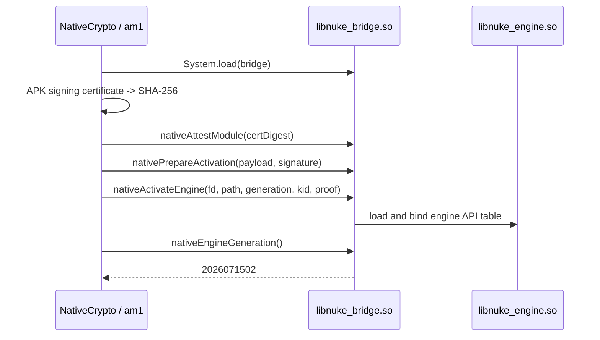
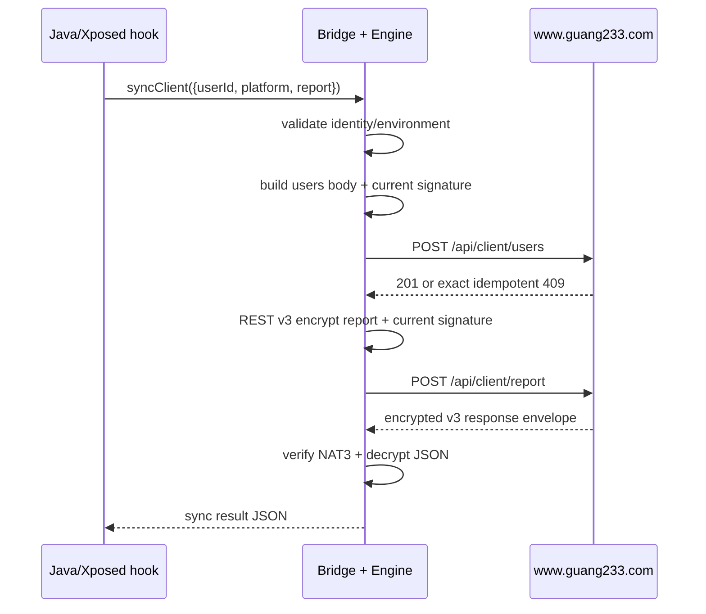

# Nuke 1.0.2 逆向与后端连接报告

## 1. 样本信息

| 文件 | 作用 | SHA-256 |
|---|---|---|
| `Nuke_1.0.2.apk` | 原始 APK | `9BC090EF451C661E41096264897103C0BAC7E45EB3A8A7E4699D7D8171B43894` |
| `libnuke_bridge.so` | APK 内 ARM64 JNI bridge | `239CFE93ACF7C7D7888F58BEA155C6364E6FE75407BF84DF2AA134AD06921AFC` |
| `bootstrap.nkr` | 内置 native release 容器 | `31F925ED5B5136D14E6BA447DD7B77D5DFE1393123FF5CCD6DC3320C8D82D0FB` |
| `release.nkm` | bootstrap 内签名元数据 | `6B4FF5DA4EB4673EA8993B356262A3504EEDA2151EE8D95338DDA6BEC0804329` |
| `libnuke_engine_2026071502_da53b572650c.so` | 解出的当前 native engine | `DA53B572650C4EA6D793592A12CA8C44C983E9D028CEE9AED3D013A07A29D54F` |

APK 常量：

- application id：`me.dartcv.nuke`
- version name：`1.0.2`
- version code：`234`
- build time：`1785243782422`
- native generation：`2026071502`
- native kid：`d8e39774`
- native 证书 SHA-256：`341e386452ad60d52c0ff2c53e06e2c385ac6f03ccfe954043193a0acde8dbe4`

证据：`../Nuke_1.0.2-jadx/sources/me/dartcv/nuke/BuildConfig.java`、`../Nuke_1.0.2-bootstrap/release.nkm`。

## 2. 工作目录说明

### 逆向工作区

| 文件夹 | 内容 |
|---|---|
| `Nuke_1.0.2-extracted/` | APK 的直接 ZIP 解包，主要含 manifest、`assets/nuke/native/bootstrap.nkr` 和 `lib/arm64-v8a/libnuke_bridge.so`。 |
| `Nuke_1.0.2-apktool/` | Apktool 输出；`smali/` 是 Dalvik 指令，`res/` 是资源，`assets/` 是原始资源，`original/` 与 `unknown/` 保存打包元数据。 |
| `Nuke_1.0.2-jadx/` | JADX 输出；`sources/` 是 Java 反编译结果，`resources/` 是资源和 native 文件副本。 |
| `Nuke_1.0.2-bootstrap/` | 从 `bootstrap.nkr` 解出的 `release.nkm` 和 ARM64 engine。 |
| `native_analysis/` | bridge、engine、DEX、bootstrap、release 元数据副本，JADX 输出和 AArch64 xref 分析脚本。 |
| `nuke_probe/` | 旧 signer 的独立 Rust 探针，用于 canonical 和 packet 实验。 |
| `nuke_unidbg/` | native bridge/engine 模拟调用实验。 |
| `unidbg-reference/` | Unidbg 框架参考依赖。 |
| `WeKit-reference/` | 最终精简后的 Python 客户端、Rust 协议参考、Android 接入样例和文档。 |

### `WeKit-reference` 内部

| 路径 | 内容 |
|---|---|
| `.editorconfig` | 该精简目录的文本格式约定。 |
| `.gitignore` | 忽略 Python 缓存、IDE 配置和 Rust `target/`。 |
| `README.md` | 运行入口与两份详细文档索引。 |
| `LICENSE` | 保留的上游许可文本。 |
| `nuke_client.py` | 纯 Python HTTP 客户端，调用真实 update API 并解码 Base64 内层 JSON。 |
| `test_nuke_api.py` | 真实联网验收脚本。 |
| `register_random.ps1` | PowerShell 注册入口，调用 Rust 随机注册示例。 |
| `REGISTRATION.md` | 注册命令、请求体、认证头、服务端状态和实测结果说明。 |
| `app/` | Android/JNI 与 Rust 参考源码容器。 |
| `app/.gitignore` | 忽略 app 层 `/build` 生成目录。 |
| `app/src/main/` | 精简后的 Android main source set；只保留 Java 接入样例和 Rust crate。 |
| `app/src/main/java/` | Android 接入参考根目录；精简后只含 `Experiments2.kt`。 |
| `app/src/main/java/dev/ujhhgtg/wekit/features/items/debug/Experiments2.kt` | 完整 WeKit 中触发 JNI Nuke sync 的 UI 接入样例。 |
| `app/src/main/rust/` | native crate 容器。 |
| `app/src/main/rust/wekit-native/` | 可独立 host-test 的 Rust crate；含 `Cargo.toml`、`Cargo.lock` 与 crate `.gitignore`。 |
| `app/src/main/rust/wekit-native/.gitignore` | 忽略该 crate 的 `target/` 和 `.cargo/`。 |
| `app/src/main/rust/wekit-native/Cargo.toml` | 最小 crate 配置及 JNI、HTTP、JSON 依赖声明。 |
| `app/src/main/rust/wekit-native/Cargo.lock` | 已解析依赖版本锁文件。 |
| `app/src/main/rust/wekit-native/src/` | Nuke JNI、HTTP 和密码协议源码根目录。 |
| `app/src/main/rust/wekit-native/src/lib.rs` | 最小 JNI 导出：Nuke 调用入口和 `JNI_OnLoad`。 |
| `app/src/main/rust/wekit-native/src/nuke_client.rs` | 注册体、报告体、canonical、请求头、HTTP 顺序和响应处理参考。 |
| `app/src/main/rust/wekit-native/src/nuke_crypto/` | config、REST、PRF、变换、签名及测试向量模块。 |
| `app/src/main/rust/wekit-native/src/nuke_crypto/rest.rs` | REST v3 envelope 加密和解密。 |
| `app/src/main/rust/wekit-native/src/nuke_crypto/sign.rs` | 已恢复的旧 native signer packet 与离线 oracle。 |
| `app/src/main/rust/wekit-native/src/nuke_crypto/prf.rs` | 自定义 sponge PRF。 |
| `app/src/main/rust/wekit-native/src/nuke_crypto/perm.rs` | PRF 使用的 ARX permutation。 |
| `app/src/main/rust/wekit-native/src/nuke_crypto/ops.rs` | REST 数据的五段可逆变换。 |
| `app/src/main/rust/wekit-native/src/nuke_crypto/mod.rs` | config C3 envelope 与模块导出。 |
| `app/src/main/rust/wekit-native/src/nuke_crypto/tests_perm.rs` | permutation 测试向量。 |
| `app/src/main/rust/wekit-native/examples/register_random.rs` | 生成随机 `wxid_`、构造注册 canonical payload、生成签名并调用真实 users endpoint。 |
| `app/src/main/rust/wekit-native/registration_results/` | 注册尝试日志目录，记录真实 HTTP 响应；当前记录为 `503 NATIVE_RELEASE_UNAVAILABLE`。 |
| `MODIFICATIONS.md` | 清理、修改和验证记录。 |
| `NUKE_1.0.2_REVERSE_REPORT.md` | 本报告。 |

`.git/` 是版本库元数据，不属于交付源码清单；`target/` 与 `__pycache__/` 是
验证时生成且已清理的缓存目录。

## 3. 后端 URL 清单

### Nuke 第一方后端

基址：`https://www.guang233.com/`

| 方法 | URL/路径 | 认证 | 用途 | 当前实测 |
|---|---|---|---|---|
| `GET` | `https://www.guang233.com/api/client/update?versionCode=234` | 无 client 签名 | 检查 APK 更新；`data` 是 Base64 JSON | `2026-08-02` 实测 `200`, `success=true` |
| `GET` | `https://www.guang233.com/api/client/native/manifest` | ETag 可选 | 拉取 native release activation manifest | `2026-08-02` 实测 `503`, `NATIVE_RELEASE_UNAVAILABLE` |
| `GET` | `https://www.guang233.com/api/client/native/releases/{releaseId}/package` | releaseId 来自 manifest | 下载 `.nkr` release 包 | `2026-08-02` 用内置 releaseId 实测 `404 NATIVE_RELEASE_NOT_FOUND` |
| `POST` | `https://www.guang233.com/api/client/users` | 6 个 `X-*` 头 | 注册或确认 client identity | 旧 signer 材料此前实测 `401 INVALID_SIGNATURE` |
| `POST` | `https://www.guang233.com/api/client/report` | 6 个 `X-*` 头 | 上传 REST v3 加密报告 | 未取得业务成功；依赖 users 注册和当前 signer |

更新接口证据：`../Nuke_1.0.2-jadx/sources/defpackage/sb.java`。native manifest/package 证据：`../Nuke_1.0.2-jadx/sources/defpackage/vl1.java`。users/report 字符串同时存在于当前 engine，并在 `nuke_client.rs` 中复刻。

### 其他网络目标

这些地址属于 app 功能或静态资源，不是 `guang233.com` Nuke client 后端：

| URL | 用途 |
|---|---|
| `https://api.github.com/users/{username}` | About/贡献者 GitHub 用户信息。 |
| `https://github.com/{username}` | 打开 GitHub 个人页。 |
| `https://api.openai.com/v1/chat/completions` | AI Chat 默认兼容接口，可由用户配置 base URL。 |
| `https://api.openai.com/v1/models` | AI 模型列表。 |
| `http://q2.qlogo.cn/headimg_dl?...` | 资源字符串中的头像 URL。 |
| `https://jiazhang.qq.com/healthy/dist/faceRecognition/game_no.html?...` | 微信功能中的腾讯页面 URL。 |

GitHub 证据：`defpackage/jp0.java`、`defpackage/ip0.java`。AI 证据：`nuke/module/wechat/ai/AIChatConfig.java`、`a.java`、`b.java`、`defpackage/u0.java`。

## 4. Native 文件和所谓“SO 加密”

### 4.1 实际包装

`libnuke_bridge.so` 和解出的 engine 都是普通 ARM64 ELF。ELF 本体没有额外全文件加密层。

`bootstrap.nkr` 以 `50 4b 03 04` 开头，是 ZIP 容器，两个 entry 的 compression method 都是 `8`，即 Deflate：

```text
release.nkm                                                   2468 bytes
lib/arm64-v8a/libnuke_engine_2026071502_da53b572650c.so   10092280 bytes
```

因此 native 保护重点是压缩封装、签名元数据、模块证书 attestation 和运行时激活，不是对 `.so` 逐字节加密。

### 4.2 `release.nkm`

外层 JSON：

```json
{
  "v": 1,
  "payload": "BASE64_JSON",
  "certificate": "BASE64_DER_CERTIFICATE",
  "signature": "BASE64_RSA_SIGNATURE"
}
```

内层 payload 的关键值：

```json
{
  "releaseId": "fcf8fce6-4f45-448d-85ba-22d934052e4b",
  "generation": 2026071502,
  "engineAbi": 1,
  "minBridgeAbi": 1,
  "minAppVersionCode": 1,
  "kid": "d8e39774",
  "engine": {
    "path": "lib/arm64-v8a/libnuke_engine_2026071502_da53b572650c.so",
    "sha256": "da53b572650c4ea6d793592a12ca8c44c983e9d028cee9aed3d013a07a29d54f",
    "size": 10092280
  }
}
```

证书是 self-signed RSA-3072，subject/issuer 都是 `CN=Admilk,OU=design by Admilk`，签名算法为 `sha256WithRSAEncryption`，证书 SHA-256 与 BuildConfig 的 pin 相同。

### 4.3 bridge 到 engine 的激活



Java 证据：`NativeCrypto.java`、`defpackage/am1.java`、`defpackage/tp0.java`、`defpackage/vl1.java`。

## 5. 报告明文和 HTTP envelope

Java 先构造传给 `NativeCrypto.syncClient()` 的 JSON：

```json
{
  "userId": "wxid_xxxxxxxxxxxxxx",
  "platform": "WECHAT",
  "report": {
    "message": "Nuke onLogin: ...",
    "environment": {
      "androidVersion": "16",
      "androidSdkInt": 36,
      "deviceBrand": "Xiaomi",
      "deviceManufacturer": "Xiaomi",
      "deviceModel": "24031PN0DC",
      "deviceName": "houji",
      "appVersion": "1.0.2",
      "appBuild": "234",
      "packageName": "com.tencent.mm",
      "architecture": "aarch64",
      "abi": "arm64-v8a",
      "xposedFramework": "Xposed",
      "xposedInjectionMode": "unknown",
      "locale": "zh-CN",
      "timezone": "Asia/Shanghai",
      "extra": {}
    }
  }
}
```

证据：`../Nuke_1.0.2-jadx/sources/defpackage/vr1.java` 第 331-346 行附近。默认 Gson 使用 `serializeNulls:false`，缺失的 observation 字段会省略。

engine 的注册体是：

```json
{"userId":"USER_ID","platform":"WECHAT"}
```

报告明文经过 REST v3 后，POST body 是：

```json
{
  "v": 3,
  "iv": "BASE64_24_BYTES",
  "kid": "d8e39774",
  "payload": "BASE64_CIPHERTEXT",
  "tag": "BASE64_32_BYTES"
}
```

## 6. REST v3 加密方法

实现位置：`app/src/main/rust/wekit-native/src/nuke_crypto/rest.rs`。

1. stream 固定为 `nuke-client-stream-v3`，kid/context 为 `d8e39774`。
2. `NMS3` 先组合 root、secret、stream 和 context。
3. 使用 `NST3`、`NPX3`、`NXP3`、`NTG3`、`NVM3`、`NGD3` 派生 6 个 32 字节子密钥，共 192 字节 key context。
4. 为每条消息生成 24 字节随机 IV。
5. 明文前面加入 32 字节 `NSV3` header，包含 `0xa703` sentinel、明文长度、tail 长度、seed 和 header tag。
6. 明文后附加 `NPD3` PRF 生成的可验证 tail。
7. 依次执行 `op1_permute`、`op2_xor`、`op3_xor`、`op4_center_xor`、`op5_feistel`。
8. 使用 `NAT3` 对版本、stream、context、IV、密文长度、密文和 MAC key 计算 32 字节 tag。
9. 解密先常量时间校验 tag，再按 Feistel、center-XOR、XOR、XOR、permutation 的逆序还原。
10. 最后校验 `NSV3` header、长度、seed、tail 和 header tag，得到 UTF-8 JSON。

Rust 测试包含 native oracle、篡改拒绝、不同长度往返和 response envelope 解密，共同证明 REST 层的字节实现可重复。

## 7. 请求签名和认证头

users/report 都需要：

```http
Content-Type: application/json
X-Client-Id: USER_ID
X-Platform: WECHAT
X-Timestamp: UNIX_SECONDS
X-Nonce: RANDOM_NONCE
X-Native-Generation: 2026071502
X-Signature: LOWERCASE_HEX_PACKET
```

签名绑定的 8 行 canonical：

```text
POST
PATH
USER_ID
WECHAT
TIMESTAMP
NONCE
2026071502
BODY
```

其中 `PATH` 是 `/api/client/users` 或 `/api/client/report`，`BODY` 必须与实际发送字节完全一致。

`sign.rs` 保存的是先前 native oracle 完整复刻：custom PRF、inner record、header、18 步 scheduler 和小写 hex 编码都通过离线向量。当前 1.0.2 engine 的 signer 入口和 attestation 绑定已更新；旧 root/companion packet 发到当前云端会得到 `INVALID_SIGNATURE`。这也是 REST 层已验证而认证 POST 尚未通过的精确分界。

### 7.1 当前 engine 与保留 signer 的差异

当前 engine 的 ELF `.text` 范围是 `0x889c40-0x99685c`。保留实现注释所指的
旧函数 `0xe9bfac`、`0xe9dfd0`、`0xeacbd0` 都在该范围之外；旧 root、旧
companion、`MASTER_KEY_64` 和旧 `KEY_TABLE` 也没有在当前 engine/bridge 中
形成字面匹配。因此 `sign.rs` 的测试通过只说明它能复现旧 oracle，不说明它
能生成 generation `2026071502` 的云端签名。

| 项目 | 旧参考实现 | Nuke 1.0.2 当前 engine 静态证据 |
|---|---|---|
| signer root | `22521becd14f33ebf6ad59aeec80f6354cff1e451a69703d03b7a7cc0243c6fa` | 隐藏 blob `0x8239f6`（`0x51` 字节）由 `0x897cdc-0x898064` 解码，再由 `0x8944f4-0x8946a4` 临时解密/重新加密。当前 64 字节值尚待 oracle 导出。 |
| companion/context | `141da00fe2e426fce669a0d1736e96f4aa0b0d269e20d331ad2fa25904417699` | signer 通过 `0x8a26d8` 读取运行态第二材料；当前值及其是否直接由证书摘要派生尚待动态确认。 |
| signer | 旧 `FUN_00eacbd0` packet builder | `0x8a4d98-0x8a5958`；仍构造 `NSK3`、`NSG3`、`NFH3`，说明 PRF/packet 主体可复用，但输入材料已变化。 |
| 请求认证 | 旧七行 canonical | `0x898a5c-0x898fec` 直接构造八行 canonical，并设置 generation 和 signature 头。 |

当前 API 表位于 `0x99d3e8`，`struct_size=0x88`、`abi=1`、
`generation=2026071502`；`nuke_engine_get_api_v1` 位于 `0x8cfdd4`。当前
signer 正常路径先解码 root，再调用 `0x8a26d8` 获取 companion/context，随后
依次进入 `NSK3(root, companion, kid)`、`NSG3(prefix_key, canonical, kid)` 和
`NFH3` 派生，使用后再次保护并清理 root。

当前同步主函数位于 `0x8cdd14-0x8cfd94`，PRF 驱动位于 `0x894ba0`；与旧
实现相同的 `243f6a88...` IV 表位于 `0x821414`。这支持复用
`prf.rs`/`perm.rs`/`ops.rs`/`sign.rs` 的算法主体，但不支持沿用旧静态 root
和 companion。当前 `401 INVALID_SIGNATURE` 的最小根因是签名材料/运行态
上下文仍旧，不是已经修正的八行 canonical 或 `X-Native-Generation`。

### 7.2 attestation 对签名路径的影响

Java 激活顺序是 `prepareModuleAttestationForActivation$app()` ->
`nativeAttestModule(certDigest)` -> `nativeActivateEngine(...)`。其中
`certDigest` 是 APK 运行态签名证书的 SHA-256；bridge 内置匹配值为
`341e386452ad60d52c0ff2c53e06e2c385ac6f03ccfe954043193a0acde8dbe4`。
engine 的 attested 状态包装位于 `0x89a824-0x89a8a4`，完整性状态采集位于
`0x8aa224-0x8ac040`；状态未建立时存在明确错误字符串
`native module is not attested`。

静态证据已经证明 attestation 是当前请求入口的前置条件，也证明 companion
来自运行态状态；现阶段尚未静态证明证书摘要本身被原样放入某个 PRF slice。
要完成当前纯 Python signer，仍需导出 `0x897cdc` 解码后的 root、hook
`0x8a26d8` 的返回值，并用固定 canonical 调用 `0x8a4d98` 取得对照向量。

## 8. 后端连接顺序



网络由当前 Rust engine 内置的 HTTPS/rustls 路径发起，目标主机固定检查为 `guang233.com`，User-Agent 字符串为 `NukeNative/3`。Java 的 update/native manifest 检查使用 OkHttp 路径。

## 9. 纯 Python 真实测试

运行：

```powershell
cd WeKit-reference
python .\test_nuke_api.py
```

该脚本独立构造 HTTPS 请求，直接访问服务器并解码响应。`2026-08-02 16:40 +08:00` 的结果：

```text
HTTP 200
outer success = true
currentVersionCode = 234
hasUpdate = false
server_time = 1785660394
```

这条验证覆盖真实 DNS、TLS、HTTP、服务端路由、JSON 和 Base64 数据。认证 users/report 需要当前 attestation signer，因此与公开 update API 分开记录。

## 10. 证据等级

- **已实测**：Python update API `HTTP 200`；Rust 42 个离线测试全通过；文件 SHA-256；ZIP/Deflate entry；release 证书和 payload。
- **静态确认**：Java 调用链、endpoint、headers、report schema、bridge activation、engine host/path 字符串，以及上述当前 engine 函数地址关系。
- **离线 oracle 确认**：REST v3 与保留的 signer packet 字节向量。
- **待动态确认**：当前 root、`0x8a26d8` companion/context、证书摘要与 PRF 输入的精确关系。
- **待完成项**：当前 generation 的 module-attestation signer 完整纯 Python 复刻，以及 users/report 的非 401 业务响应。
