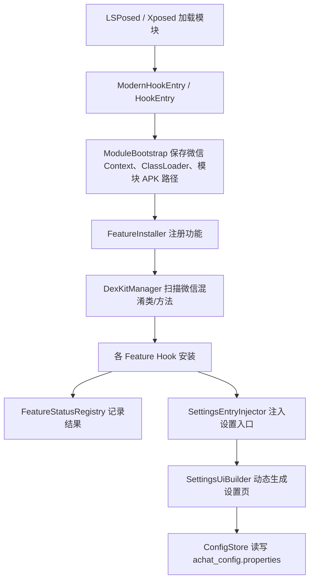

# OKK_1.2.1_fix4.apk 完整解密与源码说明

## 1. 交付结果

| 输出 | 路径 | 用途 |
|---|---|---|
| **语义化可读源码（主目录）** | `OKK_1.2.1_fix4_readable/` | JADX 重构模式、资源解码、5 个核心包和 46 个关键类已按功能改名。 |
| **指令顺序源码** | `OKK_1.2.1_fix4_readable_simple/` | JADX simple 模式；复杂方法按 DEX 指令顺序输出，用于对照重构失败的方法。 |
| **完整 Smali 与资源** | `OKK_1.2.1_fix4_apktool/` | Apktool 指令级反汇编，是 DEX 的完整基准版本。 |
| **原始 JADX 反混淆结果** | `OKK_1.2.1_fix4_decompiled/` | 保留第一次自动反混淆结果，便于与语义化版本比较。 |
| **扫描和映射资料** | `OKK_1.2.1_fix4_analysis/` | URL、字符串、配置键、每文件特征、语义映射。 |
| **JADX 语义映射** | `OKK_1.2.1_fix4_semantic.jobf` | 可直接交给 JADX 再次加载的包名/类名映射。 |

文件数量：语义化 Java **1411** 个，其中 `com.abc` 主体代码 **209** 个；simple Java **1411** 个；Smali **1576** 个；解码资源 **820** 个。

## 2. APK 基本信息

| 项目 | 结果 |
|---|---|
| 文件 | `OKK_1.2.1_fix4.apk` |
| 大小 | 3,063,058 字节 |
| SHA-256 | `B1F1DE18278158F89DDF5488FB39300236F0AB116B11073469EC3DE2A8D8B0D6` |
| 包名 | `com.abc.module` |
| 应用名 | `OKK` |
| versionName / versionCode | `1.2.1` / `13` |
| minSdk / targetSdk / compileSdk | `26` / `35` / `35` |
| 类型 | Xposed / LSPosed 模块，无普通启动 Activity |
| 目标作用域 | `com.tencent.mm`（微信） |
| 传统入口 | `com.abc.loader.HookEntry`、`com.abc.loader.ZygoteEntry` |
| libxposed 入口 | `com.abc.loader.ModernHookEntry` |
| 模块描述 | `OKK Fuck WeChat` |
| Xposed 元数据 | `name=AChat`、`author=Angus`、`version=1.1.7`、`targetApiVersion=102` |
| DEX | 单个 `classes.dex` |
| 原生库 | `arm64-v8a/libdexkit.so`、`armeabi-v7a/libdexkit.so` |
| INTERNET 权限 | Manifest 中未声明 |

元数据里的 `AChat 1.1.7` 与 APK 显示的 `OKK 1.2.1` 不一致，说明该版本保留了旧工程/旧模块名称的兼容信息。

## 3. 加密、加固与混淆判断

- 未发现常见加固壳入口、壳 Application、加密 DEX 容器或运行时释放第二份 DEX；APK 内只有一个正常 `classes.dex`。
- 两个 `.so` 均为 DexKit 的 ABI 库，用于运行时搜索微信混淆类和方法，不是业务代码壳。
- 代码使用 Kotlin + R8/ProGuard 名称压缩，原始短包名主要为 `b0`、`c0`、`d0`、`e0`、`f0`。
- 已把这 5 个核心包恢复为 `com.abc.internal.probe`、`com.abc.core.features`、`com.abc.ui`、`com.abc.core.status`、`com.abc.core.runtime`，并对 46 个关键类完成语义化命名。
- 变量名和少量方法名在发布构建时已被 R8 删除；语义化版本保留完整控制流，并通过 Java 重构版、simple 版、Smali 版三层互相校验。
- 重构模式中有 **113** 个文件带 JADX “Code decompiled incorrectly” 提示；对应逻辑可在 `OKK_1.2.1_fix4_readable_simple/` 或 `OKK_1.2.1_fix4_apktool/smali/` 查看完整指令。

## 4. 程序结构与启动流程

配置和日志默认目录：`/storage/emulated/0/Android/media/com.tencent.mm/OKK/`。

## 5. 核心功能总览

1. 消息防撤回、撤回提示模板、撤回媒体保护。
2. 消息编辑、滑动引用/复读、消息复制/转发/重发/删除/保存。
3. 消息绝对时间、相对时间、今日发送统计。
4. 朋友圈内容防删除、评论防删除、移除朋友圈广告。
5. 虚拟定位和微信地图选点。
6. 自定义聊天气泡、头像圆角、主页头像/昵称/状态、主页快捷抽屉。
7. 自定义微信壁纸、遮罩透明度、夜间模式。
8. 底部栏图标、文字、自定义名称、悬浮导航、角标。
9. 群主/管理员/成员头衔、微信 ID、实名尾标。
10. PC 登录页自动勾选、设备显示和自动确认。
11. 下载目录重定向、屏蔽热更新、隐藏主页分割线、固定折叠横幅。
12. 模块运行日志、兼容性探针、Hook 安装状态和诊断报告。

## 6. 重要文件说明

| 文件 | 介绍 |
|---|---|
| `OKK_1.2.1_fix4_readable/resources/AndroidManifest.xml` | 包信息、SDK、Xposed 元数据、Provider/Receiver；没有普通 Activity 和网络权限。 |
| `OKK_1.2.1_fix4_apktool/assets/xposed_init` | 传统 Xposed 入口列表。 |
| APK 内 `META-INF/xposed/java_init.list` | libxposed 入口 `ModernHookEntry`。 |
| APK 内 `META-INF/xposed/scope.list` | 模块作用域 `com.tencent.mm`。 |
| `.../com/abc/loader/ModernHookEntry.java` | 现代 Xposed 启动入口，微信包就绪后调用 `ModuleBootstrap`。 |
| `.../com/abc/core/runtime/ModuleBootstrap.java` | 保存宿主上下文、类加载器并启动功能安装。 |
| `.../com/abc/core/runtime/FeatureInstaller.java` | 所有 Hook 的集中安装器，是理解完整功能链的第一入口。 |
| `.../com/abc/core/runtime/SettingsUiBuilder.java` | 动态生成模块设置页面。 |
| `.../com/abc/core/features/ConfigStore.java` | 65 个主要默认配置及配置文件读写。 |
| `.../com/abc/internal/probe/DexKitManager.java` | DexKit 初始化、缓存和混淆目标定位。 |
| `.../com/abc/core/hooks/ModuleLog.java` | Xposed 日志和 `module_runtime.log` 文件日志。 |
| `OKK_1.2.1_fix4_apktool/smali/` | Java 反编译有歧义时的完整 DEX 指令基准。 |

上表中的 `...` 均指 `OKK_1.2.1_fix4_readable/sources`。

## 7. 关键类语义恢复表

| 原混淆名 | 恢复名 | 文件 | 作用 |
|---|---|---|---|
| `b0.a` | `AppFingerprint` | `OKK_1.2.1_fix4_readable/sources/com/abc/internal/probe/AppFingerprint.java` | 收集宿主微信版本、ABI、构建信息等兼容性指纹。 |
| `b0.c` | `DexKitManager` | `OKK_1.2.1_fix4_readable/sources/com/abc/internal/probe/DexKitManager.java` | 初始化 DexKit、管理缓存并执行混淆类/方法定位。 |
| `b0.k` | `FeatureProbeCatalog` | `OKK_1.2.1_fix4_readable/sources/com/abc/internal/probe/FeatureProbeCatalog.java` | 定义各功能的探针和兼容性检查项目。 |
| `b0.m` | `DiagnosticLevel` | `OKK_1.2.1_fix4_readable/sources/com/abc/internal/probe/DiagnosticLevel.java` | 诊断结果级别枚举。 |
| `b0.n` | `DiagnosticItem` | `OKK_1.2.1_fix4_readable/sources/com/abc/internal/probe/DiagnosticItem.java` | 单项诊断结果模型。 |
| `b0.s` | `CompatibilityReport` | `OKK_1.2.1_fix4_readable/sources/com/abc/internal/probe/CompatibilityReport.java` | 汇总微信版本、探针命中和功能可用性。 |
| `c0.B1` | `ThemeWallpaperConfig` | `OKK_1.2.1_fix4_readable/sources/com/abc/core/features/ThemeWallpaperConfig.java` | 保存壁纸路径、启用状态和透明度。 |
| `c0.D0` | `HomeAvatarHook` | `OKK_1.2.1_fix4_readable/sources/com/abc/core/features/HomeAvatarHook.java` | 在微信主页注入头像、昵称、状态及快捷抽屉入口。 |
| `c0.F0` | `InputStatsConfig` | `OKK_1.2.1_fix4_readable/sources/com/abc/core/features/InputStatsConfig.java` | 输入/发消息统计配置。 |
| `c0.G1` | `WallpaperOverlayHook` | `OKK_1.2.1_fix4_readable/sources/com/abc/core/features/WallpaperOverlayHook.java` | 给微信页面添加自定义壁纸和透明度遮罩。 |
| `c0.H` | `SettingsEntryHook` | `OKK_1.2.1_fix4_readable/sources/com/abc/core/features/SettingsEntryHook.java` | 向微信设置或加号菜单注入 OKK 设置入口。 |
| `c0.I0` | `InputStatsDatabase` | `OKK_1.2.1_fix4_readable/sources/com/abc/core/features/InputStatsDatabase.java` | 统计当天已发送消息数量。 |
| `c0.L1` | `VirtualLocationHook` | `OKK_1.2.1_fix4_readable/sources/com/abc/core/features/VirtualLocationHook.java` | 替换定位结果，支持地图选点和经纬度配置。 |
| `c0.N0` | `GroupMemberTitleHook` | `OKK_1.2.1_fix4_readable/sources/com/abc/core/features/GroupMemberTitleHook.java` | 识别群主/管理员/成员并绘制群头衔。 |
| `c0.O1` | `MapPickerResultHandler` | `OKK_1.2.1_fix4_readable/sources/com/abc/core/features/MapPickerResultHandler.java` | 接收地图选点结果并保存虚拟定位。 |
| `c0.Z` | `CustomBubbleHook` | `OKK_1.2.1_fix4_readable/sources/com/abc/core/features/CustomBubbleHook.java` | 替换左右聊天气泡 9.png 皮肤。 |
| `c0.a0` | `MessageDetailHook` | `OKK_1.2.1_fix4_readable/sources/com/abc/core/features/MessageDetailHook.java` | 显示消息绝对时间、相对时间等详情。 |
| `c0.c0` | `HotUpdateBlocker` | `OKK_1.2.1_fix4_readable/sources/com/abc/core/features/HotUpdateBlocker.java` | 屏蔽宿主热更新逻辑。 |
| `c0.d1` | `MomentsAdsBlocker` | `OKK_1.2.1_fix4_readable/sources/com/abc/core/features/MomentsAdsBlocker.java` | 过滤朋友圈广告。 |
| `c0.e0` | `DownloadRedirector` | `OKK_1.2.1_fix4_readable/sources/com/abc/core/features/DownloadRedirector.java` | 将下载保存位置重定向到配置目录。 |
| `c0.g` | `MomentsCommentProtectHook` | `OKK_1.2.1_fix4_readable/sources/com/abc/core/features/MomentsCommentProtectHook.java` | 拦截朋友圈评论删除/撤回并保留删除标记。 |
| `c0.h1` | `ConfigStore` | `OKK_1.2.1_fix4_readable/sources/com/abc/core/features/ConfigStore.java` | 模块总配置中心；读写 achat_config.properties，并保存默认开关。 |
| `c0.j` | `InputStatsMessageHook` | `OKK_1.2.1_fix4_readable/sources/com/abc/core/features/InputStatsMessageHook.java` | 按调用关系和字符串语义恢复的关键类。 |
| `c0.k` | `MomentsHook` | `OKK_1.2.1_fix4_readable/sources/com/abc/core/features/MomentsHook.java` | 朋友圈数据库保护和删除拦截主逻辑。 |
| `c0.m` | `MessageActionDispatcher` | `OKK_1.2.1_fix4_readable/sources/com/abc/core/features/MessageActionDispatcher.java` | 处理复制、转发、重发、删除、保存等消息动作。 |
| `c0.n` | `MessageDatabaseHook` | `OKK_1.2.1_fix4_readable/sources/com/abc/core/features/MessageDatabaseHook.java` | 定位消息表字段和数据库写入点。 |
| `c0.n0` | `MessageEditHook` | `OKK_1.2.1_fix4_readable/sources/com/abc/core/features/MessageEditHook.java` | 给聊天消息增加编辑入口并修改消息数据库内容。 |
| `c0.o` | `AntiRevokeProcessor` | `OKK_1.2.1_fix4_readable/sources/com/abc/core/features/AntiRevokeProcessor.java` | 处理消息撤回通知、替换文案和媒体保护。 |
| `c0.q0` | `FoldBannerPinHook` | `OKK_1.2.1_fix4_readable/sources/com/abc/core/features/FoldBannerPinHook.java` | 固定/折叠微信顶部横幅区域。 |
| `c0.q1` | `RealNameTailHook` | `OKK_1.2.1_fix4_readable/sources/com/abc/core/features/RealNameTailHook.java` | 在联系人/群成员界面追加实名尾标。 |
| `c0.r` | `PcAutoLoginConfig` | `OKK_1.2.1_fix4_readable/sources/com/abc/core/features/PcAutoLoginConfig.java` | Windows/PC 登录确认页自动选择与自动点击配置。 |
| `c0.v1` | `RoundAvatarHook` | `OKK_1.2.1_fix4_readable/sources/com/abc/core/features/RoundAvatarHook.java` | 统一处理头像圆角/圆形裁剪。 |
| `c0.w1` | `AvatarHook` | `OKK_1.2.1_fix4_readable/sources/com/abc/core/features/AvatarHook.java` | 定位并 Hook 微信头像相关渲染点。 |
| `c0.y` | `BottomTabConfig` | `OKK_1.2.1_fix4_readable/sources/com/abc/core/features/BottomTabConfig.java` | 管理底部 Tab 标题、悬浮样式、角标和图标。 |
| `d0.c` | `SettingsAction` | `OKK_1.2.1_fix4_readable/sources/com/abc/ui/SettingsAction.java` | 设置页点击动作分发：目录、壁纸、群组链接等。 |
| `d0.e` | `SettingsCallback` | `OKK_1.2.1_fix4_readable/sources/com/abc/ui/SettingsCallback.java` | 设置页保存、诊断复制、快捷项保存等回调。 |
| `d0.s` | `FloatingBottomTabView` | `OKK_1.2.1_fix4_readable/sources/com/abc/ui/FloatingBottomTabView.java` | 自绘悬浮底部导航栏。 |
| `e0.a` | `FeatureInstallResult` | `OKK_1.2.1_fix4_readable/sources/com/abc/core/status/FeatureInstallResult.java` | 单个功能安装结果数据。 |
| `e0.b` | `FeatureInstallStatus` | `OKK_1.2.1_fix4_readable/sources/com/abc/core/status/FeatureInstallStatus.java` | 功能状态枚举。 |
| `e0.c` | `FeatureStatusRegistry` | `OKK_1.2.1_fix4_readable/sources/com/abc/core/status/FeatureStatusRegistry.java` | 记录各 Hook 安装成功、失败和无效状态。 |
| `f0.V` | `SettingsUiBuilder` | `OKK_1.2.1_fix4_readable/sources/com/abc/core/runtime/SettingsUiBuilder.java` | 动态构建全部 OKK 设置界面。 |
| `f0.W` | `FeatureInstallTask` | `OKK_1.2.1_fix4_readable/sources/com/abc/core/runtime/FeatureInstallTask.java` | 按编号执行单项 Hook 安装任务。 |
| `f0.Z` | `FeatureInstaller` | `OKK_1.2.1_fix4_readable/sources/com/abc/core/runtime/FeatureInstaller.java` | 模块功能总安装器，集中注册所有 Hook。 |
| `f0.c0` | `ModuleBootstrap` | `OKK_1.2.1_fix4_readable/sources/com/abc/core/runtime/ModuleBootstrap.java` | 微信进程就绪后保存上下文并启动模块。 |
| `f0.f0` | `SettingsEntryInjector` | `OKK_1.2.1_fix4_readable/sources/com/abc/core/runtime/SettingsEntryInjector.java` | 向不同版本微信 UI 注入设置入口。 |
| `f0.i` | `HookDiagnostics` | `OKK_1.2.1_fix4_readable/sources/com/abc/core/runtime/HookDiagnostics.java` | 诊断 UI、活动跟踪和 Hook 状态展示。 |

完整 TSV：`OKK_1.2.1_fix4_analysis/重要类语义映射.tsv`。

## 8. URL 与网络扫描

### 8.1 应用实际外链

| URL | 用途 | 代码位置 |
|---|---|---|
| `https://t.me/OKK_Group` | 设置/快捷面板中的 Telegram 群组入口，通过 `ACTION_VIEW` 打开。 | `OKK_1.2.1_fix4_readable/sources/com/abc/ui/SettingsAction.java` |

### 8.2 非业务 URL

| URL | 用途 |
|---|---|
| `http://schemas.android.com/apk/res/android` | Android XML 属性命名空间。 |
| `http://schemas.android.com/apk/res-auto` | Android 自定义 XML 属性命名空间。 |
| `https://android.googlesource.com/toolchain/llvm-project` | `libdexkit.so` 中的 LLVM/Android 工具链构建标识，不是运行时请求地址。 |

未发现 Retrofit、OkHttp、Volley、HttpURLConnection、WebSocket、WebView 远程地址、API Base URL、登录接口、上传接口或下载接口；Manifest 也未声明 `android.permission.INTERNET`。因此该模块主要在本地 Hook 微信进程，不包含自有后端通信逻辑。

完整扫描：`OKK_1.2.1_fix4_analysis/URL清单.tsv` 和 `strings_and_urls.json`。

## 9. 配置项清单

| 配置键 | 默认值 | 功能 |
|---|---|---|
| `anti_revoke` | `true` | 消息防撤回 |
| `revoke_notice_enabled` | `true` | 显示撤回提示 |
| `anti_revoke_keep_self` | `false` | 保留自己撤回的消息 |
| `anti_revoke_notice_text` | `{name}撤回了一条消息` | 撤回提示模板 |
| `media_protect_enabled` | `true` | 撤回媒体文件保护 |
| `anti_moments_delete` | `true` | 朋友圈内容防删除 |
| `swipe_quote` | `true` | 滑动引用 |
| `swipe_repeat` | `false` | 滑动复读 |
| `quote_delete_clear` | `false` | 引用后清理删除状态 |
| `bubble_enabled` | `true` | 自定义聊天气泡 |
| `settings_entry_enabled` | `true` | 显示 OKK 设置入口 |
| `module_log_enabled` | `false` | 写入模块运行日志 |
| `bottom_tab_hide_title` | `false` | 隐藏底部栏文字 |
| `detail_enabled` | `true` | 消息详情时间 |
| `detail_template` | `${time} ${relativeTime}` | 消息详情显示模板 |
| `detail_time_pattern` | `MM-dd HH:mm:ss` | 绝对时间格式 |
| `detail_text_size` | `12` | 详情文字大小 |
| `detail_left_margin` | `0` | 详情左边距 |
| `detail_right_margin` | `0` | 详情右边距 |
| `detail_text_color_light` | `#E6000000` | 浅色模式详情颜色 |
| `detail_text_color_dark` | `#CCFFFFFF` | 深色模式详情颜色 |
| `detail_click_show` | `false` | 点击后显示详情 |
| `input_stats_enabled` | `true` | 今日发送统计 |
| `input_stats_count_send` | `true` | 统计发送动作 |
| `input_stats_template` | `今日已发${totalMsg}条` | 统计显示模板 |
| `round_avatar_enabled` | `false` | 圆形/圆角头像 |
| `round_avatar_radius` | `0.36` | 头像圆角比例 |
| `anti_moments_comment_revoke` | `true` | 朋友圈评论防撤回/删除 |
| `virtual_location_enabled` | `false` | 虚拟定位 |
| `virtual_location_latitude` | `` | 虚拟纬度 |
| `virtual_location_longitude` | `` | 虚拟经度 |
| `auto_login_win_enabled` | `false` | PC 登录页增强 |
| `auto_login_win_sync_msg` | `true` | 自动勾选同步消息 |
| `auto_login_win_show_device` | `true` | 显示登录设备 |
| `auto_login_win_auto_device` | `false` | 自动选择设备 |
| `auto_login_win_auto_click` | `true` | 自动确认登录 |
| `remove_moments_ads` | `false` | 移除朋友圈广告 |
| `profile_id` | `false` | 显示微信 ID |
| `home_avatar_entry` | `true` | 主页头像入口 |
| `home_drawer_shortcuts` | `qrcode,pay,favorite` | 主页抽屉快捷项 |
| `home_drawer_signature` | `OKK 快捷面板` | 主页抽屉签名 |
| `home_status_custom` | `` | 主页自定义状态 |
| `theme_wallpaper_enabled` | `false` | 自定义壁纸 |
| `theme_wallpaper_alpha` | `0.28` | 壁纸遮罩透明度 |
| `theme_wallpaper_path` | `` | 壁纸路径 |
| `disable_hot_update` | `false` | 屏蔽热更新 |
| `real_name_tail` | `false` | 显示实名尾标 |
| `real_name_tail_color` | `#9E9E9E` | 实名尾标颜色 |
| `member_title` | `false` | 显示群成员头衔 |
| `member_title_show_member` | `true` | 普通成员也显示头衔 |
| `member_title_owner` | `群主` | 群主头衔文案 |
| `member_title_admin` | `管理员` | 管理员头衔文案 |
| `member_title_member` | `成员` | 成员头衔文案 |
| `edit_message` | `false` | 编辑聊天消息 |
| `hide_home_divider` | `false` | 隐藏主页分割线 |
| `fold_banner_fixed` | `true` | 固定折叠横幅 |
| `bottom_tab_floating` | `false` | 悬浮底部栏 |
| `bottom_tab_floating_labels` | `true` | 悬浮栏显示标签 |
| `bottom_tab_floating_badge` | `true` | 悬浮栏显示角标 |
| `bottom_tab_title_chats` | `微信` | 配置项 |
| `bottom_tab_title_contacts` | `通讯录` | 配置项 |
| `bottom_tab_title_discover` | `发现` | 配置项 |
| `bottom_tab_title_me` | `我` | 配置项 |
| `night_mode_follow` | `true` | 夜间模式跟随系统 |
| `night_mode` | `false` | 强制夜间模式 |
| `download_redirect_enabled` | 代码默认关闭 | 下载目录重定向开关 |
| `download_redirect_dir` | `/storage/emulated/0/Android/media/com.tencent.mm/OKK/download` | 下载重定向目录 |

## 10. 文件夹逐项介绍

### 10.1 顶层输出目录

| 文件夹 | 说明 |
|---|---|
| `OKK_1.2.1_fix4_readable/sources/` | 语义化 Java 源码。 |
| `OKK_1.2.1_fix4_readable/resources/` | JADX 解码资源、Manifest、assets、原生库和元数据。 |
| `OKK_1.2.1_fix4_readable_simple/sources/` | simple 指令顺序 Java。 |
| `OKK_1.2.1_fix4_apktool/smali/` | 完整 Smali。 |
| `OKK_1.2.1_fix4_apktool/res/` | Apktool 标准资源目录。 |
| `OKK_1.2.1_fix4_apktool/assets/` | Xposed 入口、底部栏图标、气泡图片、基线配置。 |
| `OKK_1.2.1_fix4_apktool/lib/` | arm64-v8a/armeabi-v7a DexKit 库。 |
| `OKK_1.2.1_fix4_apktool/original/` | APK 原始签名/元数据保留区。 |
| `OKK_1.2.1_fix4_apktool/unknown/` | Apktool 未归类但原样保留的文件。 |
| `OKK_1.2.1_fix4_analysis/` | 自动扫描和人工语义恢复资料。 |

### 10.2 `readable/sources` 每个一级文件夹

| 文件夹 | Java 数 | 示例文件 | 说明 |
|---|---:|---|---|
| `android/` | 5 | `android/app/AppComponentFactory.java` | Android 平台兼容占位/资源类。 |
| `androidx/` | 153 | `androidx/activity/AbstractActivityC0474a.java` | AndroidX 组件，包含 Activity、Fragment、Preference、Emoji、Lifecycle 等。 |
| `com/` | 270 | `com/google/flatbuffers/AbstractC0735d.java` | 应用主体 `com.abc`、Google Material/FlatBuffers 等；关键代码已迁入语义化包名。 |
| `de/` | 4 | `de/robv/android/xposed/AbstractC0759a.java` | 传统 Xposed API（`de.robv.android.xposed`）。 |
| `kotlin/` | 1 | `kotlin/coroutines/jvm/internal/DebugProbes.java` | Kotlin 标准库与协程运行时。 |
| `org/` | 191 | `org/luckypray/dexkit/AliasKt.java` | DexKit Java API（`org.luckypray.dexkit`）及其他组织包。 |
| `p000A/` | 15 | `p000A/AbstractC0004e.java` | R8 短包名的依赖/公共运行时代码；原包名信息已被优化器压缩，文件内容已完整反编译。 |
| `p001A0/` | 33 | `p001A0/AbstractC0016B.java` | R8 短包名的依赖/公共运行时代码；原包名信息已被优化器压缩，文件内容已完整反编译。 |
| `p002B/` | 8 | `p002B/AbstractC0053c.java` | R8 短包名的依赖/公共运行时代码；原包名信息已被优化器压缩，文件内容已完整反编译。 |
| `p003B0/` | 1 | `p003B0/AbstractC0059a.java` | R8 短包名的依赖/公共运行时代码；原包名信息已被优化器压缩，文件内容已完整反编译。 |
| `p004C/` | 3 | `p004C/C0061b.java` | R8 短包名的依赖/公共运行时代码；原包名信息已被优化器压缩，文件内容已完整反编译。 |
| `p005C0/` | 1 | `p005C0/AbstractC0063a.java` | R8 短包名的依赖/公共运行时代码；原包名信息已被优化器压缩，文件内容已完整反编译。 |
| `p006D/` | 71 | `p006D/AbstractC0067D.java` | R8 短包名的依赖/公共运行时代码；原包名信息已被优化器压缩，文件内容已完整反编译。 |
| `p007D0/` | 12 | `p007D0/AbstractC0141g.java` | R8 短包名的依赖/公共运行时代码；原包名信息已被优化器压缩，文件内容已完整反编译。 |
| `p008E/` | 20 | `p008E/AbstractC0149c.java` | R8 短包名的依赖/公共运行时代码；原包名信息已被优化器压缩，文件内容已完整反编译。 |
| `p009E0/` | 29 | `p009E0/AbstractC0171b.java` | R8 短包名的依赖/公共运行时代码；原包名信息已被优化器压缩，文件内容已完整反编译。 |
| `p010F/` | 1 | `p010F/AbstractC0196a.java` | R8 短包名的依赖/公共运行时代码；原包名信息已被优化器压缩，文件内容已完整反编译。 |
| `p011F0/` | 3 | `p011F0/C0197a.java` | R8 短包名的依赖/公共运行时代码；原包名信息已被优化器压缩，文件内容已完整反编译。 |
| `p012G/` | 1 | `p012G/AbstractC0200a.java` | R8 短包名的依赖/公共运行时代码；原包名信息已被优化器压缩，文件内容已完整反编译。 |
| `p013H/` | 1 | `p013H/AbstractC0201a.java` | R8 短包名的依赖/公共运行时代码；原包名信息已被优化器压缩，文件内容已完整反编译。 |
| `p014H0/` | 5 | `p014H0/C0203b.java` | R8 短包名的依赖/公共运行时代码；原包名信息已被优化器压缩，文件内容已完整反编译。 |
| `p015I/` | 2 | `p015I/AbstractC0207a.java` | R8 短包名的依赖/公共运行时代码；原包名信息已被优化器压缩，文件内容已完整反编译。 |
| `p016I0/` | 3 | `p016I0/C0210b.java` | R8 短包名的依赖/公共运行时代码；原包名信息已被优化器压缩，文件内容已完整反编译。 |
| `p017J/` | 19 | `p017J/AbstractC0213b.java` | R8 短包名的依赖/公共运行时代码；原包名信息已被优化器压缩，文件内容已完整反编译。 |
| `p018J0/` | 7 | `p018J0/AbstractC0231a.java` | R8 短包名的依赖/公共运行时代码；原包名信息已被优化器压缩，文件内容已完整反编译。 |
| `p019K/` | 2 | `p019K/AbstractC0239b.java` | R8 短包名的依赖/公共运行时代码；原包名信息已被优化器压缩，文件内容已完整反编译。 |
| `p020K0/` | 1 | `p020K0/C0240a.java` | R8 短包名的依赖/公共运行时代码；原包名信息已被优化器压缩，文件内容已完整反编译。 |
| `p021L/` | 5 | `p021L/AbstractC0242b.java` | R8 短包名的依赖/公共运行时代码；原包名信息已被优化器压缩，文件内容已完整反编译。 |
| `p022L0/` | 1 | `p022L0/AbstractC0246a.java` | R8 短包名的依赖/公共运行时代码；原包名信息已被优化器压缩，文件内容已完整反编译。 |
| `p023M/` | 2 | `p023M/C0247a.java` | R8 短包名的依赖/公共运行时代码；原包名信息已被优化器压缩，文件内容已完整反编译。 |
| `p024M0/` | 1 | `p024M0/AbstractC0249a.java` | R8 短包名的依赖/公共运行时代码；原包名信息已被优化器压缩，文件内容已完整反编译。 |
| `p025N/` | 10 | `p025N/C0250a.java` | R8 短包名的依赖/公共运行时代码；原包名信息已被优化器压缩，文件内容已完整反编译。 |
| `p026N0/` | 12 | `p026N0/AbstractC0262c.java` | R8 短包名的依赖/公共运行时代码；原包名信息已被优化器压缩，文件内容已完整反编译。 |
| `p027O/` | 1 | `p027O/AbstractC0272a.java` | R8 短包名的依赖/公共运行时代码；原包名信息已被优化器压缩，文件内容已完整反编译。 |
| `p028P/` | 2 | `p028P/AbstractInterpolatorC0274b.java` | R8 短包名的依赖/公共运行时代码；原包名信息已被优化器压缩，文件内容已完整反编译。 |
| `p029P0/` | 22 | `p029P0/InterfaceC0275a.java` | R8 短包名的依赖/公共运行时代码；原包名信息已被优化器压缩，文件内容已完整反编译。 |
| `p030Q/` | 4 | `p030Q/AbstractC0298b.java` | R8 短包名的依赖/公共运行时代码；原包名信息已被优化器压缩，文件内容已完整反编译。 |
| `p031Q0/` | 17 | `p031Q0/AbstractC0304d.java` | R8 短包名的依赖/公共运行时代码；原包名信息已被优化器压缩，文件内容已完整反编译。 |
| `p032R/` | 1 | `p032R/AbstractC0318a.java` | R8 短包名的依赖/公共运行时代码；原包名信息已被优化器压缩，文件内容已完整反编译。 |
| `p033R0/` | 2 | `p033R0/InterfaceC0319a.java` | R8 短包名的依赖/公共运行时代码；原包名信息已被优化器压缩，文件内容已完整反编译。 |
| `p034S/` | 15 | `p034S/AbstractC0324d.java` | R8 短包名的依赖/公共运行时代码；原包名信息已被优化器压缩，文件内容已完整反编译。 |
| `p035T/` | 1 | `p035T/AbstractC0337a.java` | R8 短包名的依赖/公共运行时代码；原包名信息已被优化器压缩，文件内容已完整反编译。 |
| `p036T0/` | 3 | `p036T0/C0338a.java` | R8 短包名的依赖/公共运行时代码；原包名信息已被优化器压缩，文件内容已完整反编译。 |
| `p037U/` | 50 | `p037U/AbstractC0341A.java` | R8 短包名的依赖/公共运行时代码；原包名信息已被优化器压缩，文件内容已完整反编译。 |
| `p038U0/` | 1 | `p038U0/InterfaceC0391a.java` | R8 短包名的依赖/公共运行时代码；原包名信息已被优化器压缩，文件内容已完整反编译。 |
| `p039V/` | 5 | `p039V/C0392a.java` | R8 短包名的依赖/公共运行时代码；原包名信息已被优化器压缩，文件内容已完整反编译。 |
| `p040V0/` | 16 | `p040V0/AbstractC0407j.java` | R8 短包名的依赖/公共运行时代码；原包名信息已被优化器压缩，文件内容已完整反编译。 |
| `p041W/` | 2 | `p041W/C0414a.java` | R8 短包名的依赖/公共运行时代码；原包名信息已被优化器压缩，文件内容已完整反编译。 |
| `p042W0/` | 19 | `p042W0/AbstractC0416a.java` | R8 短包名的依赖/公共运行时代码；原包名信息已被优化器压缩，文件内容已完整反编译。 |
| `p043Y/` | 33 | `p043Y/AbstractC0435A.java` | R8 短包名的依赖/公共运行时代码；原包名信息已被优化器压缩，文件内容已完整反编译。 |
| `p044Y0/` | 1 | `p044Y0/AbstractRunnableC0468a.java` | R8 短包名的依赖/公共运行时代码；原包名信息已被优化器压缩，文件内容已完整反编译。 |
| `p045Z/` | 1 | `p045Z/AbstractC0469a.java` | R8 短包名的依赖/公共运行时代码；原包名信息已被优化器压缩，文件内容已完整反编译。 |
| `p046a/` | 1 | `p046a/InterfaceC0470a.java` | R8 短包名的依赖/公共运行时代码；原包名信息已被优化器压缩，文件内容已完整反编译。 |
| `p047a0/` | 3 | `p047a0/AbstractC0471a.java` | R8 短包名的依赖/公共运行时代码；原包名信息已被优化器压缩，文件内容已完整反编译。 |
| `p048b/` | 1 | `p048b/AbstractC0550a.java` | R8 短包名的依赖/公共运行时代码；原包名信息已被优化器压缩，文件内容已完整反编译。 |
| `p051d/` | 1 | `p051d/C0739a.java` | R8 短包名的依赖/公共运行时代码；原包名信息已被优化器压缩，文件内容已完整反编译。 |
| `p053e/` | 4 | `p053e/C0763a.java` | R8 短包名的依赖/公共运行时代码；原包名信息已被优化器压缩，文件内容已完整反编译。 |
| `p055f/` | 20 | `p055f/AbstractC0771b.java` | R8 短包名的依赖/公共运行时代码；原包名信息已被优化器压缩，文件内容已完整反编译。 |
| `p057g/` | 94 | `p057g/AbstractC0848A.java` | R8 短包名的依赖/公共运行时代码；原包名信息已被优化器压缩，文件内容已完整反编译。 |
| `p058g0/` | 1 | `p058g0/AbstractC0942a.java` | R8 短包名的依赖/公共运行时代码；原包名信息已被优化器压缩，文件内容已完整反编译。 |
| `p059h/` | 2 | `p059h/C0943a.java` | R8 短包名的依赖/公共运行时代码；原包名信息已被优化器压缩，文件内容已完整反编译。 |
| `p060h0/` | 3 | `p060h0/AbstractC0945a.java` | R8 短包名的依赖/公共运行时代码；原包名信息已被优化器压缩，文件内容已完整反编译。 |
| `p061i/` | 6 | `p061i/AbstractC0952e.java` | R8 短包名的依赖/公共运行时代码；原包名信息已被优化器压缩，文件内容已完整反编译。 |
| `p062i0/` | 2 | `p062i0/AbstractC0954a.java` | R8 短包名的依赖/公共运行时代码；原包名信息已被优化器压缩，文件内容已完整反编译。 |
| `p063j/` | 12 | `p063j/AbstractC0959d.java` | R8 短包名的依赖/公共运行时代码；原包名信息已被优化器压缩，文件内容已完整反编译。 |
| `p064j0/` | 1 | `p064j0/C0968a.java` | R8 短包名的依赖/公共运行时代码；原包名信息已被优化器压缩，文件内容已完整反编译。 |
| `p065k/` | 8 | `p065k/AbstractC0970b.java` | R8 短包名的依赖/公共运行时代码；原包名信息已被优化器压缩，文件内容已完整反编译。 |
| `p066k0/` | 1 | `p066k0/ViewOnLayoutChangeListenerC0977a.java` | R8 短包名的依赖/公共运行时代码；原包名信息已被优化器压缩，文件内容已完整反编译。 |
| `p067l/` | 1 | `p067l/AbstractC0978a.java` | R8 短包名的依赖/公共运行时代码；原包名信息已被优化器压缩，文件内容已完整反编译。 |
| `p068l0/` | 2 | `p068l0/C0979a.java` | R8 短包名的依赖/公共运行时代码；原包名信息已被优化器压缩，文件内容已完整反编译。 |
| `p069m/` | 10 | `p069m/AbstractC0988h.java` | R8 短包名的依赖/公共运行时代码；原包名信息已被优化器压缩，文件内容已完整反编译。 |
| `p070m0/` | 5 | `p070m0/C0992b.java` | R8 短包名的依赖/公共运行时代码；原包名信息已被优化器压缩，文件内容已完整反编译。 |
| `p071n/` | 10 | `p071n/AbstractC1004i.java` | R8 短包名的依赖/公共运行时代码；原包名信息已被优化器压缩，文件内容已完整反编译。 |
| `p072n0/` | 5 | `p072n0/AbstractC1010e.java` | R8 短包名的依赖/公共运行时代码；原包名信息已被优化器压缩，文件内容已完整反编译。 |
| `p073o/` | 13 | `p073o/AbstractC1024m.java` | R8 短包名的依赖/公共运行时代码；原包名信息已被优化器压缩，文件内容已完整反编译。 |
| `p074o0/` | 5 | `p074o0/C1026b.java` | R8 短包名的依赖/公共运行时代码；原包名信息已被优化器压缩，文件内容已完整反编译。 |
| `p075p/` | 19 | `p075p/AbstractC1037c.java` | R8 短包名的依赖/公共运行时代码；原包名信息已被优化器压缩，文件内容已完整反编译。 |
| `p076q/` | 1 | `p076q/AbstractC1054a.java` | R8 短包名的依赖/公共运行时代码；原包名信息已被优化器压缩，文件内容已完整反编译。 |
| `p077q0/` | 3 | `p077q0/AbstractC1055a.java` | R8 短包名的依赖/公共运行时代码；原包名信息已被优化器压缩，文件内容已完整反编译。 |
| `p078r/` | 7 | `p078r/AbstractC1058a.java` | R8 短包名的依赖/公共运行时代码；原包名信息已被优化器压缩，文件内容已完整反编译。 |
| `p079r0/` | 1 | `p079r0/C1065a.java` | R8 短包名的依赖/公共运行时代码；原包名信息已被优化器压缩，文件内容已完整反编译。 |
| `p080s/` | 1 | `p080s/AbstractC1066a.java` | R8 短包名的依赖/公共运行时代码；原包名信息已被优化器压缩，文件内容已完整反编译。 |
| `p081s0/` | 12 | `p081s0/AbstractC1069c.java` | R8 短包名的依赖/公共运行时代码；原包名信息已被优化器压缩，文件内容已完整反编译。 |
| `p082t/` | 2 | `p082t/AbstractC1080a.java` | R8 短包名的依赖/公共运行时代码；原包名信息已被优化器压缩，文件内容已完整反编译。 |
| `p083u/` | 14 | `p083u/AbstractC1083b.java` | R8 短包名的依赖/公共运行时代码；原包名信息已被优化器压缩，文件内容已完整反编译。 |
| `p084u0/` | 4 | `p084u0/C1096a.java` | R8 短包名的依赖/公共运行时代码；原包名信息已被优化器压缩，文件内容已完整反编译。 |
| `p085v/` | 10 | `p085v/AbstractC1100a.java` | R8 短包名的依赖/公共运行时代码；原包名信息已被优化器压缩，文件内容已完整反编译。 |
| `p086v0/` | 1 | `p086v0/AbstractC1110a.java` | R8 短包名的依赖/公共运行时代码；原包名信息已被优化器压缩，文件内容已完整反编译。 |
| `p087w/` | 5 | `p087w/AbstractC1111a.java` | R8 短包名的依赖/公共运行时代码；原包名信息已被优化器压缩，文件内容已完整反编译。 |
| `p088w0/` | 1 | `p088w0/C1116a.java` | R8 短包名的依赖/公共运行时代码；原包名信息已被优化器压缩，文件内容已完整反编译。 |
| `p089x0/` | 22 | `p089x0/AbstractC1128l.java` | R8 短包名的依赖/公共运行时代码；原包名信息已被优化器压缩，文件内容已完整反编译。 |
| `p090y0/` | 2 | `p090y0/C1139a.java` | R8 短包名的依赖/公共运行时代码；原包名信息已被优化器压缩，文件内容已完整反编译。 |
| `p091z/` | 1 | `p091z/AbstractC1142a.java` | R8 短包名的依赖/公共运行时代码；原包名信息已被优化器压缩，文件内容已完整反编译。 |
| `p092z0/` | 5 | `p092z0/AbstractC1145c.java` | R8 短包名的依赖/公共运行时代码；原包名信息已被优化器压缩，文件内容已完整反编译。 |

### 10.3 `com.abc` 应用代码文件夹

| 文件夹 | 说明 |
|---|---|
| `com/abc/loader/` | Xposed/LSPosed 启动入口。 |
| `com/abc/core/hooks/` | 模块自身日志等基础 Hook 支持。 |
| `com/abc/core/runtime/` | 模块启动、功能安装、设置 UI、诊断。 |
| `com/abc/core/features/` | 消息、朋友圈、外观、定位、底部栏等实际功能。 |
| `com/abc/core/status/` | 功能安装状态和结果模型。 |
| `com/abc/internal/probe/` | DexKit、微信版本指纹和兼容性探针。 |
| `com/abc/ui/` | 设置动作、回调、浮动底部栏等 UI。 |

### 10.4 资源文件夹

- 基础资源目录：`anim/`、`animator/`、`color/`、`color-night/`、`color-v31/`、`drawable/`、`drawable-hdpi/`、`drawable-ldrtl-hdpi/`、`drawable-ldrtl-mdpi/`、`drawable-ldrtl-xhdpi/`、`drawable-ldrtl-xxhdpi/`、`drawable-ldrtl-xxxhdpi/`、`drawable-mdpi/`、`drawable-watch/`、`drawable-xhdpi/`、`drawable-xxhdpi/`、`drawable-xxxhdpi/`、`interpolator/`、`layout/`、`layout-land/`、`layout-watch/`、`values/`、`xml/`。
- `values/`：默认字符串、颜色、尺寸、样式、数组等。
- `values-*`：共 106 个语言、屏幕尺寸、夜间模式、API 版本和密度限定目录；完整目录名如下：

`values-af`、`values-am`、`values-ar`、`values-as`、`values-az`、`values-b+es+419`、`values-b+sr+Latn`、`values-be`、`values-bg`、`values-bn`、`values-bs`、`values-ca`、`values-cs`、`values-da`、`values-de`、`values-el`、`values-en-rAU`、`values-en-rCA`、`values-en-rGB`、`values-en-rIN`、`values-en-rXC`、`values-es`、`values-es-rUS`、`values-et`、`values-eu`、`values-fa`、`values-fi`、`values-fr`、`values-fr-rCA`、`values-gl`、`values-gu`、`values-h360dp-land`、`values-h480dp-land`、`values-h720dp`、`values-hdpi`、`values-hi`、`values-hr`、`values-hu`、`values-hy`、`values-in`、`values-is`、`values-it`、`values-iw`、`values-ja`、`values-ka`、`values-kk`、`values-km`、`values-kn`、`values-ko`、`values-ky`、`values-land`、`values-large`、`values-lo`、`values-lt`、`values-lv`、`values-mk`、`values-ml`、`values-mn`、`values-mr`、`values-ms`、`values-my`、`values-nb`、`values-ne`、`values-night`、`values-nl`、`values-or`、`values-pa`、`values-pl`、`values-port`、`values-pt`、`values-pt-rBR`、`values-pt-rPT`、`values-ro`、`values-ru`、`values-si`、`values-sk`、`values-sl`、`values-small`、`values-sq`、`values-sr`、`values-sv`、`values-sw`、`values-sw360dp`、`values-sw600dp`、`values-ta`、`values-te`、`values-th`、`values-tl`、`values-tr`、`values-uk`、`values-ur`、`values-uz`、`values-v28`、`values-v31`、`values-v34`、`values-vi`、`values-w320dp-land`、`values-w360dp-port`、`values-w400dp-port`、`values-w600dp-land`、`values-watch`、`values-xlarge`、`values-zh-rCN`、`values-zh-rHK`、`values-zh-rTW`、`values-zu`

### 10.5 Assets 与原生库

| 路径 | 说明 |
|---|---|
| `assets/xposed_init` | 传统 Xposed 入口。 |
| `assets/abc_bottom_tab/` | 微信、通讯录、发现、我四个底部栏图标。 |
| `assets/abc_bubble/` | 左右聊天气泡 `.9.png`。 |
| `assets/dexopt/` | Android Baseline Profile。 |
| `lib/arm64-v8a/libdexkit.so` | 64 位 ARM DexKit。 |
| `lib/armeabi-v7a/libdexkit.so` | 32 位 ARM DexKit。 |

## 11. 阅读建议

1. 从 `ModernHookEntry.java` 阅读进程入口。
2. 继续查看 `ModuleBootstrap.java` 和 `FeatureInstaller.java`，理解安装顺序。
3. 在 `ConfigStore.java` 按配置键定位功能。
4. 进入 `core/features/` 查看具体 Hook。
5. 遇到 JADX 警告时，用同名 simple 文件对照；需要逐条确认时查看 Apktool Smali。

## 12. 生成工具与可重复步骤

- JADX 1.5.5：重构模式 + `--deobf` + 自定义 JOBF 语义映射。
- JADX 1.5.5 simple 模式：补充复杂控制流。
- Apktool 3.0.2：资源解码与 Smali 反汇编。
- `analyze_okk.py`：字符串、URL、配置键和文件特征扫描。
- `build_semantic_mapping.py`：生成语义化 JADX 映射。
- `generate_okk_report.py`：生成本说明和 TSV 清单。
