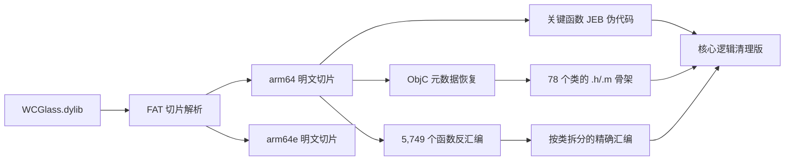

# WCGlass 液态玻璃逆向与源码恢复项目

> 本目录包含 `WCGlass.dylib` 原始文件、arm64/arm64e 明文切片、Objective-C 源码骨架、核心逻辑清理版、全部函数 ARM64 汇编、JEB 伪代码及可复现分析脚本。

## 项目概览

`WCGlass.dylib` 是面向微信界面的液态玻璃与主题增强组件。当前分析结果覆盖主题包导入与解密、主题商店通信、玻璃背景、首页分组、聊天页胶囊、搜索覆盖层、功能卡片、颜色编辑、主题管理及设置界面等模块。

核心结果：

| 项目 | 结果 |
|---|---|
| 文件格式 | Mach-O Universal/FAT 动态库 |
| 架构 | arm64、arm64e |
| 原始大小 | 11,848,688 字节 |
| SHA-256 | `76ba59a63ba3606753cddd7c63c557d9a3765baecb85fe3d1f39384e62227320` |
| 加密状态 | 两个切片均为 `cryptid=0` |
| Objective-C 实现类 | 78 个 |
| Objective-C 方法 | 1,923 个 |
| ARM64 函数 | 5,749 个 |
| 保留符号 | 454 个 |
| 导入函数桩 | 206 个 |
| 当前目录文件 | 295 个 |
| 当前目录大小 | 81,595,255 字节 |



## 快速阅读

推荐按以下顺序查看：

1. [完整解密说明](./WCGlass_restored/WCGlass完整解密说明.md)
2. [核心逻辑清理版说明](./WCGlass_restored/05_clean_reconstruction/README.md)
3. [恢复类索引](./WCGlass_restored/03_objc_source_all/ClassIndex.md)
4. [Objective-C 源码说明](./WCGlass_restored/03_objc_source_all/README.md)
5. [精确 ARM64 汇编说明](./WCGlass_restored/04_exact_arm64_assembly/README.md)
6. [文件校验清单](./WCGlass_restored/CHECKSUMS.sha256)

## 根目录文件介绍

| 文件或文件夹 | 作用 |
|---|---|
| `WCGlass.dylib` | 原始 Universal/FAT 动态库，包含 arm64 和 arm64e 两个切片 |
| `WCGlass_output/` | 第一阶段 Mach-O 解包、切片、接口、符号、字符串及密码流程分析结果 |
| `WCGlass_restored/` | 整理后的源码恢复工程，是主要阅读目录 |
| `wcglass_unpack.py` | FAT/Mach-O、加密标志、符号与 Objective-C 元数据解析器 |
| `restore_wcglass_source.py` | 生成类源码、函数索引、完整汇编和核心清理代码 |
| `JebDecompileTargets.py` | 使用 JEB 批量反编译指定关键函数 |
| `JebExportWCGlass.py` | JEB 原生单元与函数信息导出脚本 |
| `JebScriptRunner.java/.class` | Windows 环境中的 JEB 脚本启动器 |
| `JebProbe.py` | 探测 JEB 项目、原生单元和反编译器状态 |

## `WCGlass_output` 介绍

该目录保存第一阶段的原始分析产物：

| 文件 | 内容 |
|---|---|
| `WCGlass_plain.dylib` | 与原文件字节一致的 Universal 明文副本 |
| `WCGlass_arm64_plain.dylib` | 单独提取的 arm64 切片 |
| `WCGlass_arm64e_plain.dylib` | 单独提取的 arm64e 切片 |
| `WCGlass_report.txt` | Mach-O 头、切片、节区、依赖和加密状态 |
| `WCGlass_objc_interfaces.h` | 从 runtime 元数据直接恢复的接口声明 |
| `WCGlass_objc_strings.txt` | 类名、selector、类型编码及普通字符串 |
| `WCGlass_symbols.txt` | 导入、导出和保留符号 |
| `WCGlass_sensitive_hits.txt` | 密钥、加密、鉴权、网络和主题相关字符串 |
| `WCGlass_crypto_disassembly_arm64.txt` | 主题加解密主流程的带注释反汇编 |
| `WCGlass_crypto_helpers_arm64.txt` | AES、HMAC、SHA 和 RSA 调用参数证据 |
| `WCGlass_crypto_summary.txt` | 密码算法和关键入口摘要 |

## `WCGlass_restored` 目录介绍

```text
WCGlass_restored/
├─ 01_jeb_decompiled_c/        全函数声明和地址索引
├─ 02_key_modules_jeb/         关键函数的 JEB C 伪代码
├─ 03_objc_source_all/         78 个 Objective-C 类源码骨架
├─ 04_exact_arm64_assembly/    5,749 个函数的精确 ARM64 汇编
├─ 05_clean_reconstruction/    人工清理后的核心实现
├─ 06_metadata/                原始静态分析证据
├─ 07_tools/                   可复现工具副本
├─ CHECKSUMS.sha256            关键文件哈希
└─ WCGlass完整解密说明.md       完整中文技术说明
```

### 全函数索引

`01_jeb_decompiled_c/` 用于按地址定位函数：

- `FunctionIndex.csv`：记录 5,749 个函数的地址、结束位置、大小和名称。
- `AllFunctions.h`：全部函数的 C 声明索引。

### 关键函数伪代码

`02_key_modules_jeb/` 保存密码和主题业务入口的高层 C 伪代码，主要包括：

| 地址 | 文件或功能 |
|---:|---|
| `0x2E4DD8` | `WCLGGlassPackage` 主题容器解析、SHA-256 与 RSA-PSS 验签 |
| `0x2E5CE8` | AES-256-CBC 解密辅助函数 |
| `0x2E5ECC` | 主题数据导入、文件落盘及索引更新 |
| `0x2E727C` | 已安装主题载荷读取与解密 |
| `0x2ED1F4` | 主题 HMAC-SHA256 辅助函数 |
| `0x2F198C` | 商店请求密钥、Nonce 和 RSA 包装流程 |
| `0x2F2C2C` | 通用 AES-256-CBC 辅助函数 |
| `0x2F3020` | 商店 HMAC-SHA256 辅助函数 |
| `0x2F3140` | 商店响应验签与解密入口 |

JEB 对 11 个目标中的 9 个生成了高层伪代码；`0x2F3140` 和 `0x2FA73C` 的行为由精确 ARM64 汇编、Objective-C 元数据及 `05_clean_reconstruction/` 中的清理版实现共同覆盖。

### Objective-C 源码树

`03_objc_source_all/Classes/` 为每个实现类生成独立的 `.h` 和 `.m`：

- `.h` 文件保存类接口、类方法和实例方法。
- `.m` 文件保存方法骨架、原始 IMP 地址和 type encoding。
- `WCGlassRecovered.h` 聚合导入全部恢复类。
- `ClassIndex.md` 列出每个类的方法数量和类地址。

主要类：

| 类 | 作用 |
|---|---|
| `WCLGGlassPackage` | 主题容器格式、导入、验签、解密与缓存 |
| `WCLGGlassStore` | 主题商店请求、密钥、响应验签与解密 |
| `WCLGGlassTheme` | 主题数据模型 |
| `WCLGConfig` | 功能开关与配置中心 |
| `WCLGSettingsViewController` | 设置页面 |
| `WCLGHomeGroups` | 首页会话分组逻辑 |
| `WCLGHomeGroupBar` | 首页分组栏和胶囊界面 |
| `WCLGSearchTabBarOverlay` | 搜索页面与标签栏玻璃覆盖层 |
| `WCLGFuncCardPanelView` | 功能卡片面板 |
| `WCLGColorPickerViewController` | 主题颜色编辑器 |
| `WCLGThemeManageViewController` | 本地主题管理 |
| `WCLGVoiceWaveView` | 语音波形与玻璃视觉效果 |

### 精确 ARM64 汇编

`04_exact_arm64_assembly/` 是行为核对的精确层：

- `AllFunctions_arm64.s` 覆盖全部 5,749 个函数。
- `Classes/*.s` 按 Objective-C 类和 selector 拆分函数。
- `_objc_msgSend`、`_CCCrypt`、`_CCHmac`、`_SecKeyVerifySignature` 等导入调用已经标注。

### 清理后的核心代码

`05_clean_reconstruction/` 将匿名函数、字符串初始化噪声和密码包装整理成可读 Objective-C：

- `WCLGCryptoRecovered.h/.m`
  - AES-256-CBC
  - PKCS#7 Padding
  - HMAC-SHA256
  - SHA-256
  - RSA-OAEP-SHA256
  - RSA-PSS-SHA256
- `WCLGGlassPackage_Recovered.m`
  - 主题容器读取
  - 元数据解析
  - RSA-PSS 验签
  - 密钥派生
  - AES 解密
- `WCLGGlassStore_Recovered.m`
  - 请求加密
  - Nonce 处理
  - 响应验签
  - 响应解密

已确认的 CommonCrypto 参数：

```text
algorithm = kCCAlgorithmAES
options   = kCCOptionPKCS7Padding
key       = 32 bytes
IV        = 16 bytes
```

`CCHmac` 使用 `kCCHmacAlgSHA256`，输出长度为 32 字节。

## 解密状态说明

原始 `WCGlass.dylib` 的两个架构切片均存在 `LC_ENCRYPTION_INFO_64`，并且：

```text
arm64  cryptid = 0
arm64e cryptid = 0
```

因此文件层内容已经是明文。`WCGlass_plain.dylib` 是原文件的字节一致副本；两个 thin dylib 用于分别分析 arm64 和 arm64e 指令及元数据。

主题资源本身还包含应用层密码流程，该部分已在 `05_clean_reconstruction/` 中按真实调用参数恢复。

## 重新生成分析结果

在 `D:\folder\codex\解密\WCGlass` 中运行：

```powershell
python .\wcglass_unpack.py
python .\restore_wcglass_source.py
```

JEB 辅助脚本及启动器位于根目录和 `WCGlass_restored/07_tools/`，可用于重新导出指定函数的高层伪代码。

## Evidence → Finding → Path

| Evidence | Finding | Path |
|---|---|---|
| FAT 头及两个 Mach-O 切片 | 文件同时包含 arm64 与 arm64e | `WCGlass_output/WCGlass_report.txt` |
| 两个切片的 `LC_ENCRYPTION_INFO_64` | 两个切片均为 `cryptid=0` 明文 | `WCGlass_output/WCGlass_report.txt` |
| Objective-C runtime 元数据 | 恢复 78 个实现类和 1,923 个方法 | `WCGlass_restored/03_objc_source_all/` |
| `LC_FUNCTION_STARTS` 和代码节 | 恢复 5,749 个函数及精确指令 | `WCGlass_restored/04_exact_arm64_assembly/` |
| `_CCCrypt`、`_CCHmac`、Security.framework 调用 | 确认 AES/HMAC/SHA/RSA 参数和流程 | `WCGlass_restored/05_clean_reconstruction/` |
| SHA-256 清单 | 原文件及关键恢复文件可进行一致性验证 | `WCGlass_restored/CHECKSUMS.sha256` |

